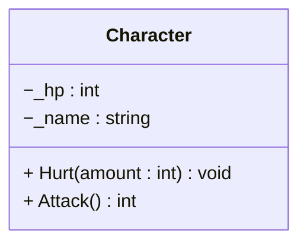

```mermaid
classDiagram
  class Character{
        −_hp : int
        −_name : string 
        +  Hurt(amount : int) void
        + Attack() int
  }
```

```cs linenums="5"
int hp = 100;

while (hp > 0)
{
  hp -= Random.Shared.Next(5);
  Console.WriteLine($"HP: {hp}");
}
```

!!! warning test
    dhwrt

=== "C#"
    Hello
=== "Python"
Hello2


