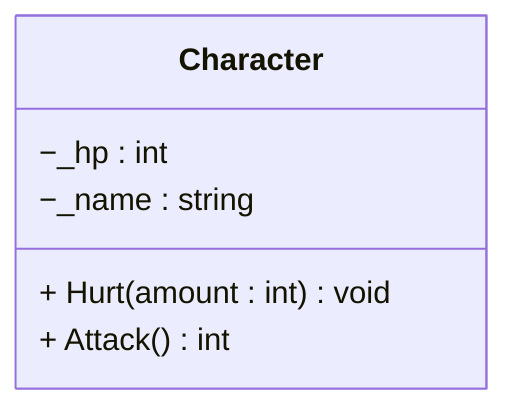

```cs linenums="5"
int hp = 100;

while (hp > 0)
{
  hp -= Random.Shared.Next(5);
  Console.WriteLine($"HP: {hp}");
}
```

!!! warning Hello
    aehteyj

=== "C#"
    Hello
=== "Python"
    arewrh


```c++ title="sdth" linenums="1"
ahwrt6
```
    


| Method      | Description                          |
| ----------- | ------------------------------------ |
| `GET`       | :material-check:     Fetch resource  |
| `PUT`       | :material-check-all: Update resource |
| `DELETE`    | :material-close:     Delete resource |

++ctrl+alt++